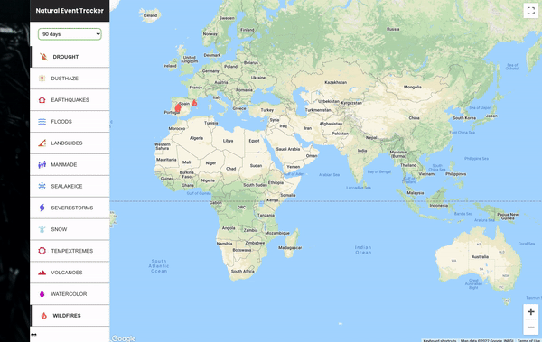

## Natural Event Tracker 🌏
A web app for showing natural events using React, NASA EONET API, and Google Map API. The user can choose several events to show and limit the number of prior days from which events will be returned.

### Examples of use

  

* [Video Demo](https://youtu.be/EHqpn9Xm5ZY)
* [Live Demo](https://hrmtk-naturaleventtracker.netlify.app)🔥 - The app has been deployed to Netlify.

### Technologies
* React
  * Iconify - for event icons
* Sass
  * [include-media](https://raw.githubusercontent.com/eduardoboucas/include-media/master/dist/_include-media.scss) - for responsive design

### API
* Async/await syntax with axios and EONET API to fetch events data.
  * [Axios](https://axios-http.com) is an HTTP client library.
  * [EONET](https://eonet.gsfc.nasa.gov/docs/v3)(Earth Observatory Natural Event Tracker) version 3.0 is powered by NASA.
    * Example: `https://eonet.gsfc.nasa.gov/api/v3/events?category=severeStorms,wildfires&days=10`  
    * Return the events of severe storms and wildfires within the past 10 days.
* google-map-react to display a map to plot returned events on.
  * [google-map-react](https://www.npmjs.com/package/google-map-react) is a component written over a small set of the [Google Maps API](https://developers.google.com/maps/documentation/javascript/overview).

### Inspiration
* [Build a Wildfire Tracker With React & NASA API by Traversy Media](https://youtu.be/ontX4zfVqK8)